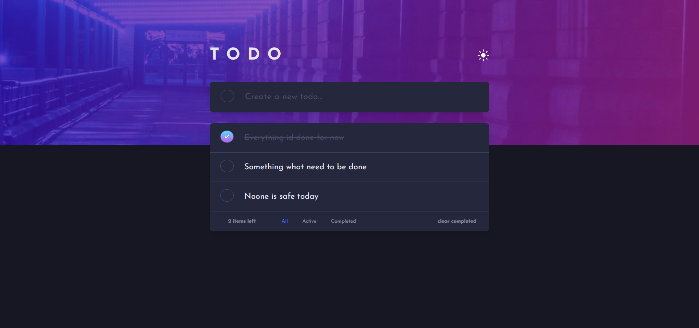

# Frontend Mentor - Todo app

This is a solution to the [Todo app challenge on Frontend Mentor](https://www.frontendmentor.io/challenges/todo-app-Su1_KokOW). Frontend Mentor challenges help you improve your coding skills by building realistic projects. 

## Table of contents

- [Overview](#overview)
  - [The challenge](#the-challenge)
  - [Screenshot](#screenshot)
  - [Links](#links)
  - [Built with](#built-with)
- [Author](#author)

## Overview

### The challenge

Users should be able to:

- View the optimal layout for the app depending on their device's screen size
- See hover states for all interactive elements on the page
- Add new todos to the list
- Mark todos as complete
- Delete todos from the list
- Filter by all/active/complete todos
- Clear all completed todos
- Toggle light and dark mode

- **Bonus**: Drag and drop to reorder items on the list

### Screenshot



### Links

- Solution URL: https://codesandbox.io/s/todo-app-i0j1o

### Built with

- Semantic HTML5 markup
- CSS custom properties
- Flexbox
- CSS Grid
- [Vuejs](https://v3.vuejs.org/) - JavaScript Framework

## Author

- Website - [Lukáš Žáček]
- Frontend Mentor - [@JimmCarry](https://www.frontendmentor.io/profile/JimmCarry)
- Twitter - [@JimCarr88260202](https://twitter.com/JimCarr88260202)

# todo

## Project setup
```
npm install
```

### Compiles and hot-reloads for development
```
npm run serve
```

### Compiles and minifies for production
```
npm run build
```

### Lints and fixes files
```
npm run lint
```

### Customize configuration
See [Configuration Reference](https://cli.vuejs.org/config/).
